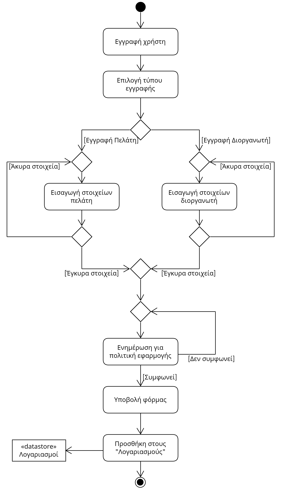
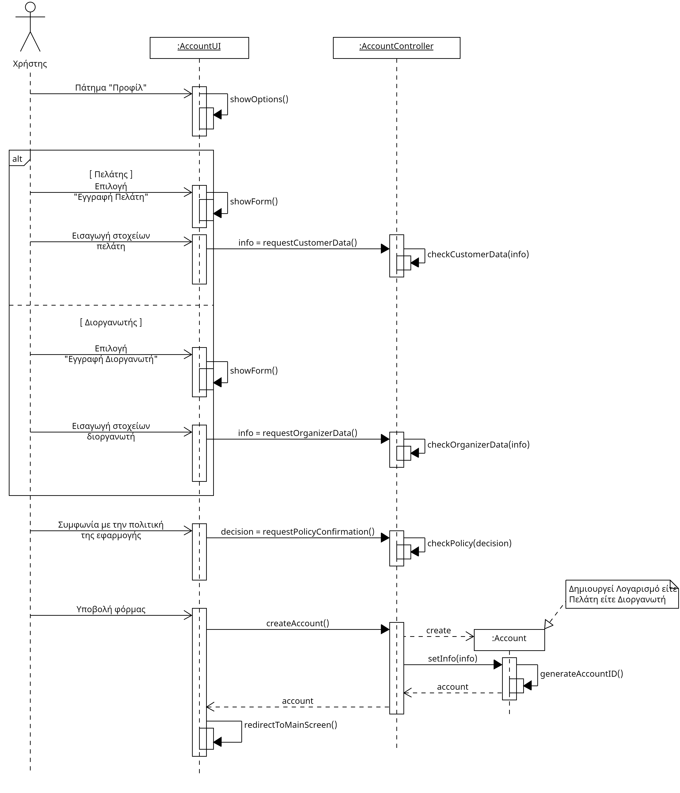

# ΠΧ1. Διαχείριση Λογαριασμού

**Πρωτεύων Actor:** Χρήστης   
**Ενδιαφερόμενοι:**

**Χρήστης**: Θέλει να μπορεί να δημιουργεί τον λογαριασμό του προσδιορίζοντας ποιος θα είναι ο ρόλος του στην εφαρμογή και να επεξεργάζεται με ευκολία τα στοιχεία του.
  
**Προϋποθέσεις**: 
1) Η σύνδεση και αποσύνδεση από το σύστημα, η επεξεργασία στοιχείων και η διαγραφή λογαριασμού απαιτούν να υπάρχει ο λογαριασμός.
2) Η αποσύνδεση από το σύστημα, η επεξεργασία στοιχείων και η διαγραφή λογαριασμού απαιτούν επίσης ο χρήστης να είναι συνδεδεμένος.

## Βασική Ροή
### Α) Εγγραφή
1) Ο χρήστης πατάει την επιλογή "Εγγραφή" από το μενού.
2) Ο χρήστης διαλέγει ανάμεσα στην επιλογή "Εγγραφή ως Πελάτης" και "Εγγραφή ως Διοργανωτής".
3) Το σύστημα του εμφανίζει μία φόρμα με τα απαραίτητα στοιχεία εγγραφής.[*](#notes)
4) Ο χρήστης εισάγει τα απαιτούμενα στοιχεία ανάλογα με τον τύπο εγγραφής του.
5) Ο χρήστης πατάει "Συνέχεια" και το σύστημα ελέγχει τα στοιχεία του.
6) Το σύστημα ενημερώνει τον χρήστη για την πολιτική της εφαρμογής.
7) Ο χρήστης επιλέγει ότι είναι σύμφωνος με την πολιτική και πατάει "Υποβολή".
8) Το σύστημα επικυρώνει την ενέργεια και ενημερώνει ότι η εγγραφή ολοκληρώθηκε επιτυχώς.
9)  Το σύστημα προσθέτει τον λογαριασμό στην λίστα των "Λογαριασμών".
10) Το σύστημα δίνει στον χρήστη τα αντίστοιχα δικαιώματα.
11) Το σύστημα μεταφέρει τον χρήστη στην αρχική οθόνη της εφαρμογής σύμφωνα με την εγγραφή που έκανε.

## Εναλλακτικές Ροές
*4α. Ο χρήστης δεν συμπλήρωσε κάποιο υποχρεωτικό στοιχείο ή εισήγαγε λανθασμένα στοιχεία.*  
   1. Το σύστημα ενημερώνει τον χρήστη για τα παρελειπόμενα ή μη έγκυρα πεδία.
   2. Η περίπτωση χρήσης επιστρέφει στο βήμα 4) της βασικής ροής χωρίς να καταχωρείται η εγγραφή.

*4β. Ο χρήστης πληκτρολογεί ήδη υπάρχον email.*
   1. Το σύστημα ενημερώνει τον χρήστη για τα επικαλυπτόμενα πεδία.
   2. Η περίπτωση χρήσης επιστρέφει στο βήμα 4) της βασικής ροής χωρίς να καταχωρείται η εγγραφή.

*7α. Ο χρήστης δεν συμφωνεί με την πολιτική της εφαρμογής.*
   1. Το σύστημα ενημερώνει ότι είναι απαραίτητο να συμφωνεί με την πολιτική για να δημιουργθεί ο λογαριασμός του.
   2. Η περίπτωση χρήσης επιστρέφει στο βήμα 7) της βασικής ροής χωρίς να καταχωρείται η εγγραφή.

### Β) Σύνδεση Χρήστη
1) Ο χρήστης πατάει την επιλογή "Σύνδεση" από το μενού.
2) Το σύστημα εμφανίζει μία φόρμα με τα στοιχεία της σύνδεσης.
3) Ο χρήστης εισάγει το email και τον κωδικό πρόσβασης του είτε πρόκειται για πελάτη είτε για διοργανωτή και πατάει "Σύνδεση".
   - *3α. Ο χρήστης άφησε κάποιο πεδίο κενό.*
      1. Το σύστημα ενημερώνει τον χρήστη ότι τα πεδία είναι υποχρεωτικά.
      2. Η περίπτωση χρήσης επιστρέφει στο βήμα 4) του σεναρίου χωρίς να συμβαίνει σύνδεση. 
4) Το σύστημα επιβεβαιώνει ότι ο χρήστης έχει λογαριασμό.
   - *4α. Ο χρήστης δεν βρ΄εθηκε.*
      1. Το συστήμα εμφανίζει ότι ο χρήστης δεν βρέθηκε και τον προτρέπει να ξαναδοκιμάσει να συνδεθεί.
      2. Η περίπτωση χρήσης επιστρέφει στο βήμα 4) του σεναρίου χωρίς να συμβαίνει σύνδεση.
5) Το σύστημα ενημερώνει ότι η σύνδεση ολοκληρώθηκε επιτυχώς.
6) Το σύστημα μεταφέρει τον πελάτη ή διοργανωτή με τα αντίστοιχα δικαιώματα στην αρχική οθόνη της εφαρμογής.
 
### Γ) Επεξεργασία Λογαριασμού
1) Ο χρήστης πατάει την επιλογή "Επεξεργασία Λογαριασμού" από την αρχική οθόνη της εφαρμογής.
2) Το σύστημα εμφανίζει ένα πλαίσιο με τα ήδη καταχωρημένα στοιχεία του πελάτη ή του διοργανωτή.
3) Ο χρήστης τροποποιεί τα στοιχεία που επιθυμεί και πατάει "Αλλαγή".   
   - *3α. Ο χρήστης αφήσε κενό κάποιο υποχρεωτικό στοιχείο ή εισήγαγε λάθος νέα στοιχεία.*  
      1. Το σύστημα ενημερώνει τον χρήστη για τα παρελειπόμενα ή μη έγκυρα πεδία.
      2. Η περίπτωση χρήσης επιστρέφει στο βήμα 4) του σεναρίου χωρίς καμία αλλαγή να γίνεται δεκτή.
4) Το σύστημα επεξεργάζεται τα στοιχεία του λογαριασμού από την λίστα των "Λογαριασμών"
5) Το σύστημα επικυρώνει την ενέργεια και ενημερώνει ότι οι αλλαγές καταχωρήθηκαν.
6) Το σύστημα μεταφέρει τον χρήστη στην αρχική οθόνη της εφαρμογής.

### Ε) Αποσύνδεση
1) Ο χρήστης πατάει την επιλογή "Αποσύνδεση" από το μενού.
2) Το σύστημα μεταφέρει τον χρήστη στην αρχική οθόνη της εφαρμογής χωρίς κανένα δικαίωμα πέρα από αναζήτηση.

## 2.1.3 Διάγραμμα δραστηριότητας 

## 2.3.2 Διάγραμμα ακολουθίας

## Notes
- Note: Στα περισσότερα βήματα της ροής όλων των σεναρίων ο χρήστης θα μπορεί να πατήσει το βελάκι επιστροφής ώστε να επιστρέψει στο προηγούμενο βήμα του σεναρίου ή με το κουμπί ακύρωσης να κλείσει το πλαίσιο που του έχει εμφανιστεί με αποτέλεσμα η περίτωση χρήσης να τερματιστεί.

- *Note: Τα απαιτούμενα στοχεία για την εγγραφή πελάτη είναι
1)Ονοματεπώνυμο, 2)Ηλικία ,3)Φύλο ,4)Ενδιαφέροντα ,5)email ,6)Κωδικός πρόσβασης και για τον διοργανώτη τα ίδια με την προσθήκη των 7)Αριθμός αστυνομικής ταυτότητας και 8)ΑΦΜ.
 