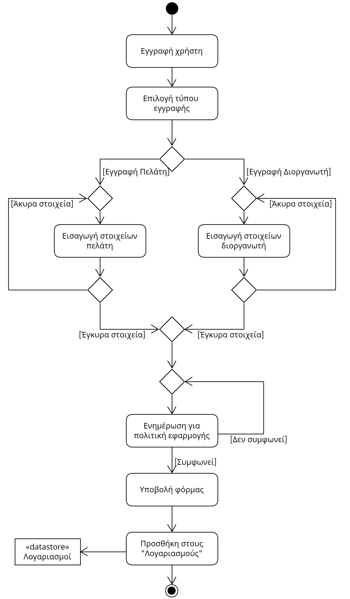
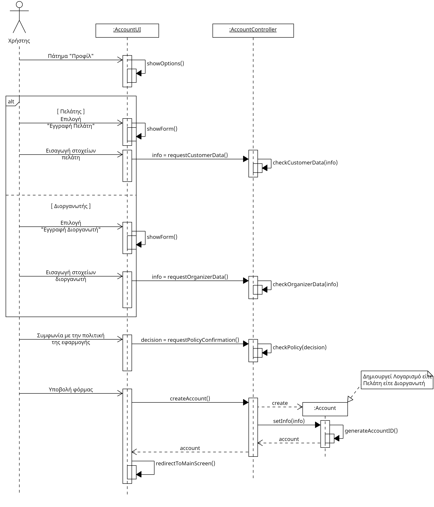

# UC1. Account Management

**Primary Actor:** User  
**Stakeholders:**  

**User**: Wants to be able to create their account by specifying their role in the application and easily manage their details.  

**Preconditions**:  
1) Connection and disconnection from the system, editing details, and account deletion require an existing account.  
2) Disconnection from the system, editing details, and account deletion also require the user to be logged in.

## Basic Flow
### A) Registration
1) The user selects "Register" from the menu.
2) The user chooses between "Register as a Customer" and "Register as an Organizer".
3) The system displays a form with the necessary registration details.[*](#notes)
4) The user enters the required details according to their registration type.
5) The user clicks "Continue," and the system verifies their details.
6) The system informs the user about the application's policy.
7) The user agrees to the policy and clicks "Submit."
8) The system verifies the action and informs the user that the registration was successful.
9) The system adds the account to the list of "Accounts."
10) The system grants the user the corresponding permissions.
11) The system redirects the user to the application's home screen based on their registration.

## Alternate Flows
*4a. The user left some mandatory field blank or entered incorrect information.*  
   1. The system informs the user about the missing or invalid fields.
   2. The use case returns to step 4) of the basic flow without registering the account.

*4b. The user enters an email that already exists.*  
   1. The system informs the user about the overlapping fields.
   2. The use case returns to step 4) of the basic flow without registering the account.

*7a. The user disagrees with the application's policy.*  
   1. The system informs the user that agreeing to the policy is necessary to create their account.
   2. The use case returns to step 7) of the basic flow without registering the account.

### B) User Login
1) The user selects "Login" from the menu.
2) The system displays a form with the login details.
3) The user enters their email and password, either as a customer or an organizer, and clicks "Login."
   - *3a. The user left a field blank.*
      1. The system informs the user that the fields are mandatory.
      2. The use case returns to step 4) of the scenario without logging in.
4) The system confirms that the user has an account.
   - *4a. The user is not found.*
      1. The system displays that the user was not found and prompts them to try logging in again.
      2. The use case returns to step 4) of the scenario without logging in.
5) The system informs that the login was successful.
6) The system redirects the customer or organizer with the respective permissions to the application's home screen.

### C) Edit Account
1) The user selects "Edit Account" from the application's home screen.
2) The system displays a dialog with the customer's or organizer's already entered details.
3) The user modifies the desired details and clicks "Change."
   - *3a. The user left a mandatory field blank or entered incorrect new details.*
      1. The system informs the user about the missing or invalid fields.
      2. The use case returns to step 4) of the scenario without accepting any changes.
4) The system updates the account details from the "Accounts" list.
5) The system verifies the action and informs the user that the changes were recorded.
6) The system redirects the user to the application's home screen.

### D) Logout
1) The user selects "Logout" from the menu.
2) The system redirects the user to the application's home screen with no permissions other than search.

## Activity Diagram

## Sequence Diagram

## Notes
- Note: In most steps of the flow for all scenarios, the user will be able to click the back arrow to return to the previous step of the scenario or use the cancel button to close the dialog that appeared, terminating the use case.
- *Note: The required elements for customer registration are:
1) Full Name, 2) Age, 3) Gender, 4) Interests, 5) Email, 6) Password, and for the organizer, the same with the addition of 7) ID Number and 8) Tax ID Number.
