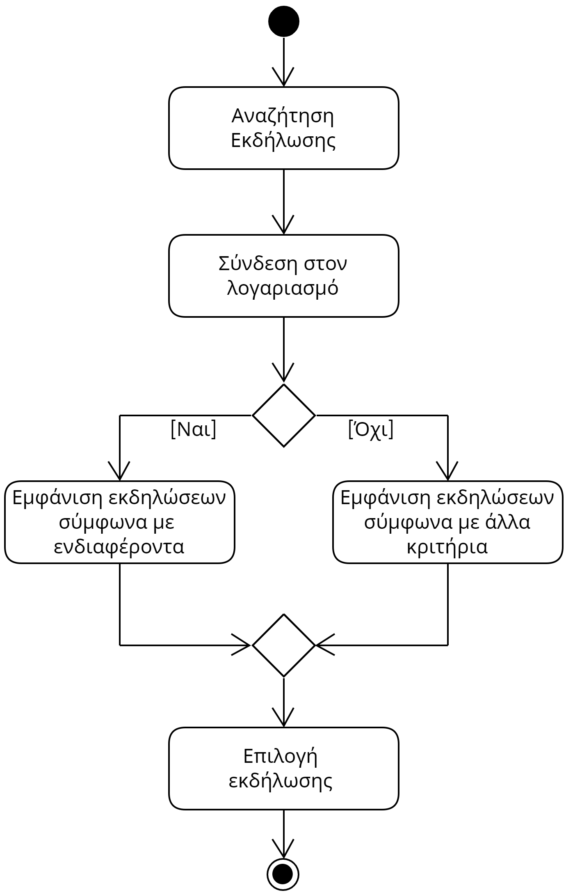
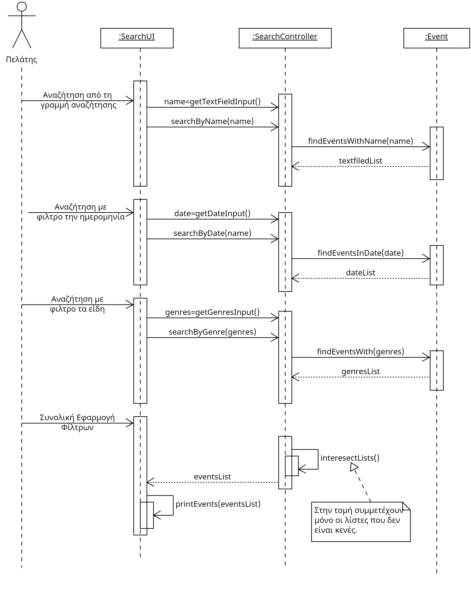

# UC2. Event Search

**Primary Actor:** Customer  
**Stakeholders:**  

**Customer**: Wants to easily and quickly find the event that suits them.  

**Preconditions**: -

## Basic Flow
### A) Search with Filters
1) The customer types the name of the event they are looking for in the search bar.
2) The customer sets the time frame within which they want the event they are looking for to take place.
3) The customer selects the type of event they are looking for.
4) The customer clicks "Search."
5) The system displays all events that match the customer's filters.
6) The customer selects the event they desire.
   
## Alternate Flows
*1a. The customer does not type anything in the search bar.*  
   1. Nothing happens for now; the flow continues.

*2a. The customer did not specify the time frame.*
   1. Nothing happens for now; the flow continues.
   
*3a. The customer did not select the type of event.*
   1. Nothing happens for now; the flow continues.

*4a. The customer has not applied any filters.*
   1. The system displays all active events.
   2. The flow goes to step 6) of the basic flow.

### B) Automatic Search
1) The customer logs into their account.
    - *1a. The customer chooses not to log in or does not have an account.*  
        1. The system displays all active events.
2) The system displays all events that match the interests declared by the customer in their profile.
3) The customer selects the event they desire.

## Activity Diagram

## Sequence Diagram

