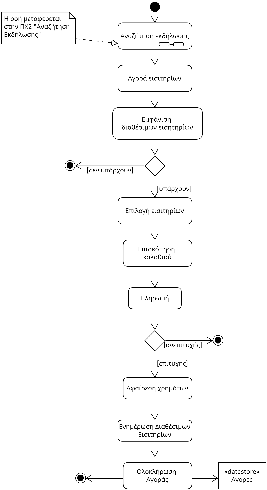
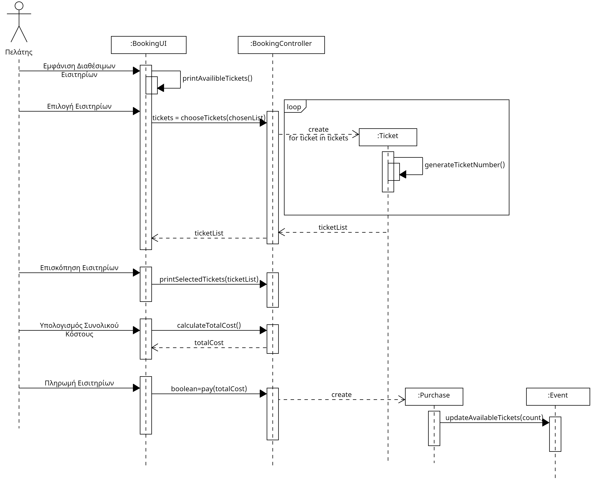

# UC4. Ticket Reservation

**Primary Actor**: Customer  
**Stakeholders**: 

**Customer**: Wants to manage tickets electronically for convenience.

**Preconditions**: 
1) The customer must have registered and be logged into their account.
2) To purchase or reserve a ticket, the customer must first perform a search.

## Basic Flow
### A) Ticket Purchase
1) [The customer searches using any method.](2.event-search.md)
2) The customer selects the event labeled "Buy Now".
3) The system displays ticket categories, the cost of each, and the available quantity for each category.
4) The customer selects the desired tickets from each category and clicks "Continue".
5) The system asks the customer to select a discount package.
6) The customer selects the discount package they are entitled to.
7) The system displays a dialog informing the user of their choices and the total cost.
8) The user clicks "Payment".
9) The system confirms that the payment was successful and adds the event to the user's active events.
10) The system updates the available tickets for the event.
11) The system updates the statistics for the event.

## Alternative Flows
*4a. No tickets are available.*
   1. The system informs the customer of the unavailability.
   2. The use case terminates.

## Activity Diagram

## Sequence Diagram

