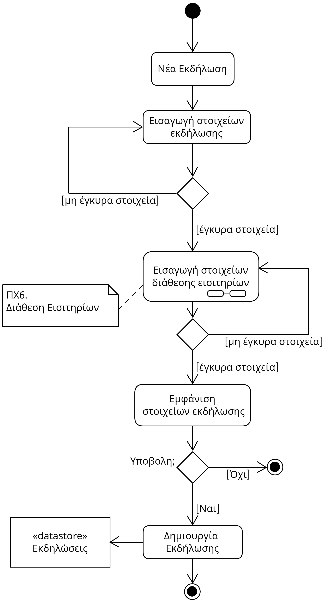
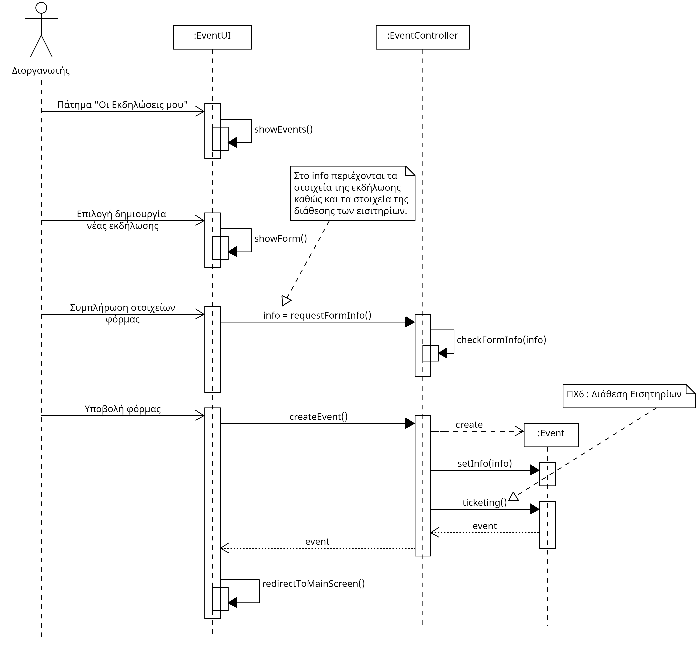

# UC5. Event Management

**Primary Actor**: Organizer  
**Stakeholders**: 

**Organizer**: Wants to easily create, publicize, and edit events as needed.

**Customer**: Wants to be informed about changes to events they are interested in.

**Preconditions**: 
1) The organizer must have registered as an organizer and be logged into their account.
2) The organizer can only edit an event if they have created it.

## Basic Flow:
### A) Event Creation
1) The organizer selects "My Events" from the menu.
2) The system displays the organizer's events (active and inactive) and the option "Create Event".
3) The organizer selects "Create Event".
4) The system displays a form with the event details.
5) The organizer enters the required event details.[*](#notes)
6) [The organizer sets up ticket disposal for various categories.](6.ticket-disposal.md)
7) The system displays the organizer's options for confirmation.
8) The organizer clicks "Submit".
9) The system adds the event to the list of "Events".
10) The system notifies the organizer of the successful event creation.
11) The system navigates the organizer to the application's home screen.

## Alternative Flows:
*5a. The organizer enters incorrect details or leaves fields blank.*  
   1. The system informs the organizer about the missing or invalid fields.
   2. The use case returns to step 4) of the basic flow.

### B) Event Editing
1) The organizer selects "My Events" from the menu.
2) The system displays the organizer's events and the option "Edit Event".
   - *2a. The organizer has no active events.*
      1. The system informs the user that they have no events and prompts them to create one.
      2. The use case terminates.
3) The organizer selects the active event they want to edit and clicks "Edit Event".
4) The system displays a form with the existing event details.
5) The organizer modifies the desired event details and clicks "Continue".
   - *5a. The organizer enters incorrect new details or leaves fields blank.* 
      1. The system informs the user about missing or invalid fields.
      2. The use case returns to step 4) of the scenario.
6) [The organizer edits the ticket disposal details.](6.ticket-disposal.md)
7) The system updates the event in the list of "Events".
8) The system notifies the organizer of the successful event editing.
9) The system navigates the organizer to the application's home screen.

## Activity Diagram

## Sequence Diagram

## Notes
- Note: In most steps of the flow of all scenarios, the user can click the back arrow to return to the previous step or use the cancel button to close the dialog box, terminating the use case.
- Note: We assume that all fields in the event creation and editing form are mandatory. Also, two events with the same name, location, and date cannot exist simultaneously.
- *Note: The event details include the name, location, date, type, and more.  also here
