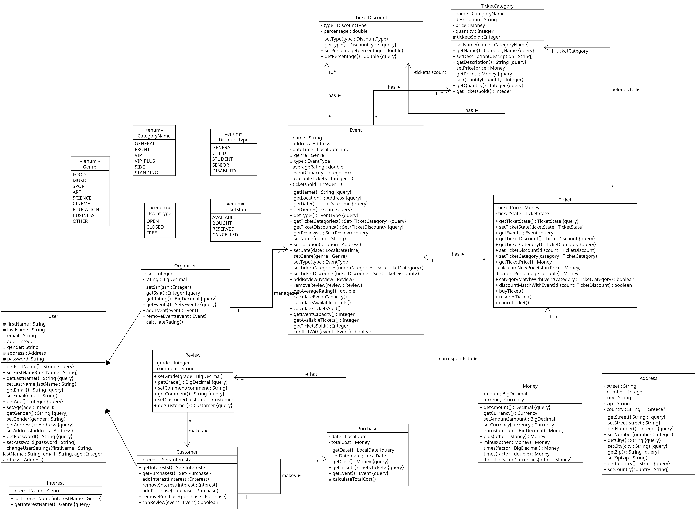
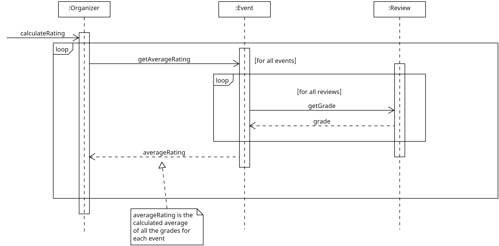
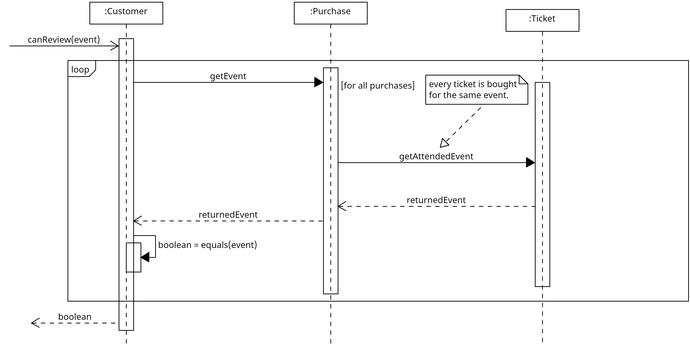
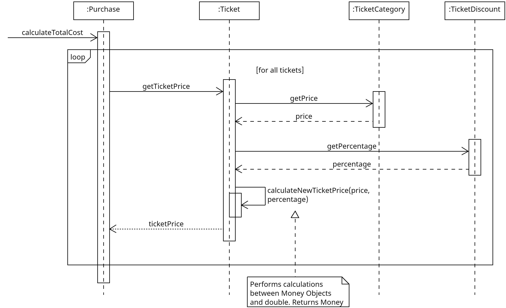
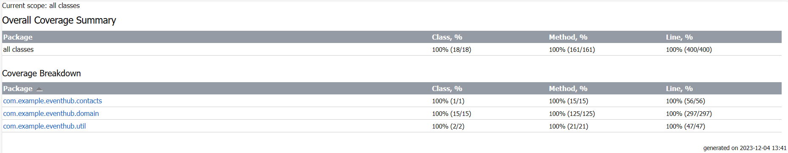

## 3.1 Domain Logic Diagrams

### Class Diagram - Static View

### Sequence Diagrams - Dynamic View
1. calculateRating Method of Organizer

2. canReview Method of Customer

3. calculateTotalCost Method of Purchase

## 3.2 Implementation of Domain Logic
## [Link to the main package](../../../app/src/main/)

## 3.3 Automated Tests with JUnit
## [Link to the test package](../../../app/src/test/)

## 3.4 Code Coverage Reports

