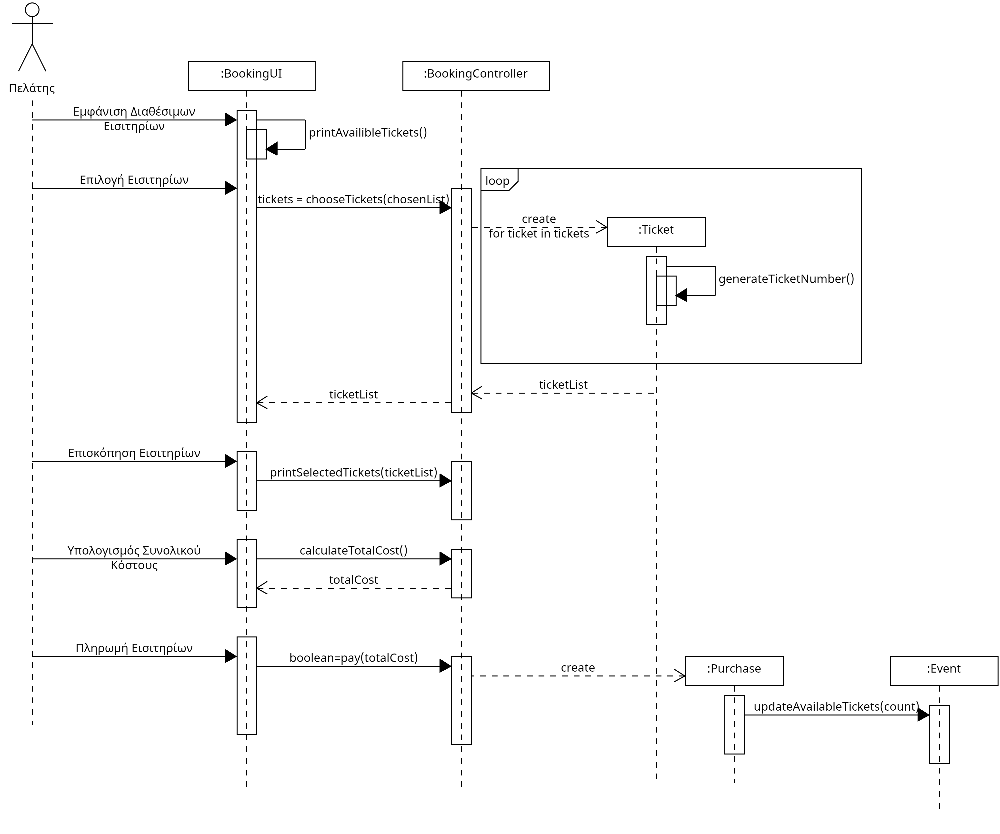

# ΠΧ4. Κράτηση Εισιτηρίων

**Πρωτεύων Actor**: Πελάτης  
**Ενδιαφερόμενοι**: 

**Πελάτης**: Θέλει να κάνει την διαχείριση των εισιτηρίων του ηλεκτρονικά προς δική του διευκόλυνση.

**Προϋποθέσεις**: 
1) Ο πελάτης πρέπει να έχει κάνει εγγραφή και να είναι συνδεδεμένος στον λογαριασμό του.
2) Για να μπορεί ο πελάτης να αγοράσει ή να κρατήσει εισιτήριο πρέπει πρώτα να έχει κάνει αναζήτηση.  

## Βασική Ροή
### Α) Αγορά εισιτηρίων
1) [Ο πελάτης αναζητεί με οποιοδήποτε τρόπο.](2.event-search-greek.md)
2) Ο πελάτης πατάει την επιλογή της εκδήλωσης με ετικέτα "Αγοράστε Τώρα".
3) Το σύστημα εμφανίζει τις κατηγορίες εισιτηρίων, το κόστος της κάθε μίας και τον διαθέσιμο αριθμό από κάθε κατηγορία.
4) Ο πελάτης επιλέγει τα εισιτήρια που επιθυμεί από την κάθε κατηγορία και πατάει "Συνέχεια".
5) Το σύστημα ζητάει απο τον πελάτη να επιλέξει πακέτο έκπτωσης.
6) Ο πελάτης επιλέγει το πακέτο έκπτωσης που δικαιούται.
7) Το σύστημα εμφανίζει ένα πλαίσιο που ενημερώνει τον χρήστη για τις επιλογές του και το συνολικό κόστος.
8) Ο χρήστης πατάει την επιλογή "Πληρωμή".
9) Το σύστημα επιβεβαιώνει ότι η πληρωμή ολοκληρώθηκε επιτυχώς και προσθέτει την εκδήλωση στις ενεργές εκδηλώσεις του.
10) Το σύστημα ενημερώνει τα διαθέσιμα εισιτήρια για την εκδήλωση.
11) Το σύστημα ενημερώνει τα στατιστικά της εκδήλωσης.

## Εναλλακτικές Ροές
*4α. Δεν υπάρχουν διαθέσιμα εισιτήρια.*  
   1. Το σύστημα ενημερώνει τον πελάτη για την μη διαθεσιμότητα.
   2. Η περίπτωση χρήσης τερματίζει.

## 2.1.3 Διάγραμμα δραστηριότητας 

## 2.3.2 Διάγραμμα ακολουθίας

