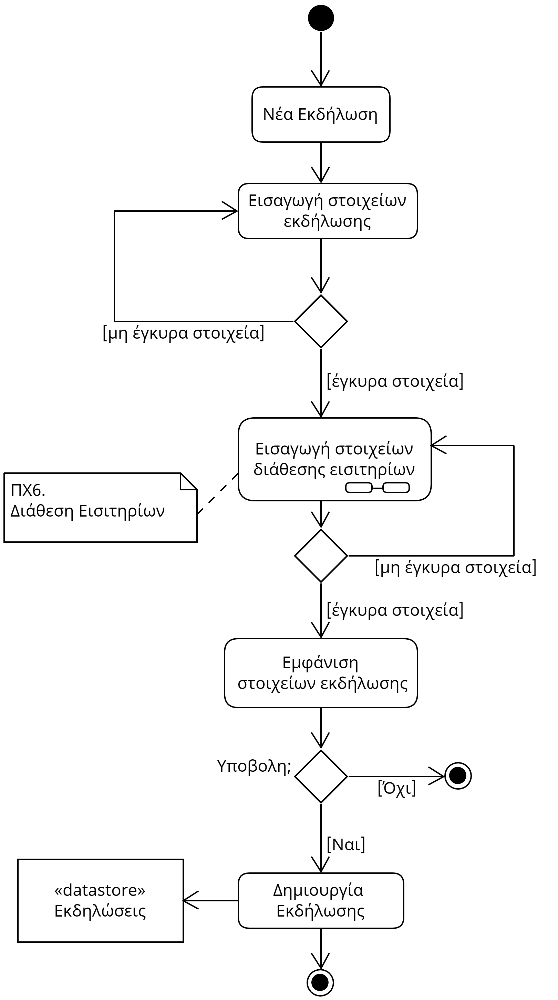

# ΠΧ5. Διαχείριση Εκδήλωσης

**Πρωτεύων Actor**: Διοργανωτής  
**Ενδιαφερόμενοι**:

**Διοργανωτής**: Θέλει να μπορεί με ευκολία να δημιουργεί εκδηλώσεις,
να τις κοινοποιεί και να τις επεξεργάζεται όποτε επιθυμεί.

**Πελάτης**: Θέλει να μπορεί να ενημερώνεται για τις αλλαγές που συμβαίνουν σε εκδηλώσεις που τον αφορούν.

**Προϋποθέσεις**: 
1) Ο διοργανωτής πρέπει να έχει κάνει εγγραφή διοργανωτή και να είναι συνδεδεμένος στον λογαριασμό του.
2) Ο διοργανωτής μπορεί να επεξεργαστεί μία εκδήλωση μόνο αν την έχει δημιουργήσει.

## Βασική Ροή:
### Α) Δημιουργία Εκδήλωσης
1) Ο διοργανωτής πατάει την επιλογή "Οι Εκδηλώσεις μου" από το μενού.
2) Το σύστημα εμφανίζει τις εκδηλώσεις του διοργανωτή(ενεργές και μη) και την επιλογή "Δημιουργία Εκδήλωσης".
3) Ο διοργανωτής επιλέγει την "Δημιουργία Εκδήλωσης".
4) Το σύστημα εμφανίζει μια φόρμα με τα στοιχεία της εκδήλωσης.
5) Ο διοργανωτής εισάγει τα απαιτούμενα στοιχεία για την εκδήλωση.[*](#notes)
6) [Ο διοργανωτής διαθέτει εισιτήρια για τις διάφορες κατηγορίες.](6.ticket-disposal-greek.md)
7) Το σύστημα εμφανίζει τις επιλογές του διοργανωτή για επιβεβαίωση.
8) Ο διοργανωτής πάταει την επιλογή "Υποβολή".
9) Το σύστημα προσθέτει την εκδήλωση στην λίστα των "Εκδηλώσεων".
10) Το σύστημα ενημερώνει τον διοργανωτή για την επιτυχή δημιουργία της εκδήλωσης.
11) Το σύστημα μεταφέρει τον διοργανωτή στην αρχική οθόνη της εφαρμογής.

## Εναλλακτικές Ροές
*5α. Ο διοργανωτής εισάγει λανθασμένα στοιχεία ή αφήνει κενά.*  
   1. Το σύστημα ενημερώνει τον διοργανωτή για τα παρελειπόμενα ή μη έγκυρα πεδία.
   2. Η περίπτωση χρήσης επιστρέφει στο βήμα 4) της βασικής ροής.

### Β) Επεξεργασία Εκδήλωσης
1) Ο διοργανωτής πατάει την επιλογή "Οι Εκδηλώσεις μου" από το μενού.
2) Το σύστημα εμφανίζει τις εκδηλώσεις του διοργανωτή και την επιλογή "Δημιουργία Εκδήλωσης".
   - *2α. Ο διοργανωτής δεν έχει καμία ενεργή εκδήλωση.*
      1. Το σύστημα ενημερώνει τον χρήστη ότι δεν έχει καμία εκδήλωση και τον προτρέπει να δημιουργήσει μία.
      2. Η περίπτωση χρήσης τερματίζεται.
3) Ο διοργανωτής διαλέγει την ενεργή εκδήλωση που θέλει να επεξεργαστεί και πατάει την επιλογή "Επεξεργασία Εκδήλωσης".
4) Το σύστημα εμφανίζει μία φόρμα με τα ήδη καταχωρημένα στοιχεία της εκδήλωσης.
5) Ο διοργανωτής τροποποιεί τα επιθυμητά στοιχεία της εκδήλωσης και πατάει "Συνέχεια".
   - *5α. Ο διοργανωτής εισάγει λανθασμένα νέα στοιχεία ή αφήνει κενά.* 
      1. Το σύστημα ενημερώνει τον χρήστη για τα παρελειπόμενα πεδία ή μη έγκυρα πεδία.
      2. Η περίπτωση χρήσης επιστρέφει στο βήμα 4) του σεναρίου.
6) [Ο διοργανωτής επεξεργάζεται τα στοιχεία σχετικά με την διάθεση εισιτηρίων.](6.ticket-disposal-greek.md)
7) To σύστημα επεξεργάζεται την εκδήλωση από την λίστα των "Εκδηλώσεων".
8) Το σύστημα ενημερώνει τον διοργανωτή για την επιτυχή επεξεργασία της εκδήλωσης.
9)  Το σύστημα μεταφέρει τον διοργανωτή στην αρχική οθόνη της εφαρμογής.

## 2.1.3 Διάγραμμα δραστηριότητας 

## 2.3.2 Διάγραμμα ακολουθίας 

## Notes
- Note: Στα περισσότερα βήματα της ροής όλων των σεναρίων ο χρήστης θα μπορεί να πατήσει το βελάκι επιστροφής ώστε να επιστρέψει στο προηγούμενο βήμα του σεναρίου ή με το κουμπί ακύρωσης να κλείσει το πλαίσιο που του έχει εμφανιστεί με αποτέλεσμα η περίτωση χρήσης να τερματιστεί.
- Note: Θεωρούμε ότι όλα τα στοιχεία της φόρμας για την δημιουργία και επεξεργασίας εκδήλωσης είναι υποχρεωτικά. Επίσης δεν μπορεί να υπάρχουν δύο εκδηλώσεις με ίδιο όνομα, ίδιο τόπο και ημερομηνία ταυτόχρονα.
- *Note: Τα στοιχεία της εκδήλωσης είναι το όνομα, η τοποθεσία, η ημερομηνία δειξαγωγής, είδος και άλλα. 