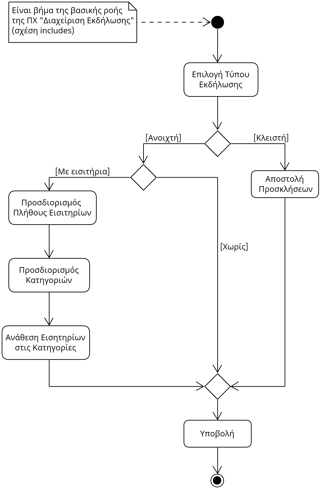

# ΠΧ6. Διάθεση Εισιτηρίων

**Πρωτεύων Actor**: Διοργανωτής  
**Ενδιαφερόμενοι**: 

**Διοργανωτής**: Θέλει να μπορεί με ευκολία να διαθέτει εισιτήρια για τις εκδηλώσεις που δημιουργεί.
  
**Προϋποθέσεις**:  
1) Η διάθεση εισιτηρίων είναι ένα βήμα της "Δημιουργίας Εκδήλωσης" (σχέση includes), οπότε για να μπορέσει ο διοργανωτής να διαθέσει εισιτήρια πρέπει να έχει προχωρήσει την διαδικάσια δημιουργίας της εκδήλωσης.

## Βασική Ροή
### A) Διάθεση Εισιτηρίων 
1) Το σύστημα εμφανίζει μια φόρμα για τις κατηγορίες εισιτηρίων με πεδία (Όνομα, Περογραφή, Ποσότητα, Τιμή). 
2) Ο διοργανωτής συμπληρώνει τα στοιχεία της φόρμας.
3) Ο διοργανωτής πατάει "Συνέχεια".
4) Το σύστημα του εμφανίζει μια φόρμα για τα πακέτα εκπτώσεων με πεδία (Όνομα, Έκπτωση).
5) Ο διοργναωτής συμπληρώνει τα στοιχεία της φόρμας.
6) Ο διοργανωτής πατάει "Συνέχεια".
7) Η ροή επιστρέφει στο βήμα 6) του σεναρίου "Δημιουργία Εκδήλωσης" του use case "Διαχείριση Εκδήλωσης". 

## Εναλλακτικές Ροές:
*2α. Ο διοργανωτής αφήνει κενά.*
   1. Το σύστημα ενημερώνει ότι όλα τα πεδία ειναι υποχρεωτικά.
   2. Η περίπτωση χρήσης επιστρέφει στο βήμα 4) της βασικής ροής. 
      
*2β. Ο διοργανωτής εισάγει λανθασμένα στοιχεία.*
   1. Το σύστημα εμφανίζει συγκεκριμένο μήνυμα λάθους.
   2. Η περίπτωση χρήσης επιστρέφει στο βήμα 4) της βασικής ροής.

*3α. Ο διοργανωτής πατάει "Προσθήκη".*
   1. Η ροή επιστρέφει στο βήμα 1 της βασικής ροής.
   
*5α. Ο διοργανωτής αφήνει κενά.*
   1. Το σύστημα ενημερώνει ότι όλα τα πεδία ειναι υποχρεωτικά.
   2. Η περίπτωση χρήσης επιστρέφει στο βήμα 4) της βασικής ροής. 
      
*5β. Ο διοργανωτής εισάγει λανθασμένα στοιχεία.*
   1. Το σύστημα εμφανίζει συγκεκριμένο μήνυμα λάθους.
   2. Η περίπτωση χρήσης επιστρέφει στο βήμα 4) της βασικής ροής.

*6α. Ο διοργανωτής πατάει "Προσθήκη".*
   1. Η ροή επιστρέφει στο βήμα 4 της βασικής ροής.

## Β) Επεξεργασία Εισιτηρίων
1) To σύστημα εμφανίζει ένα πλαίσιο με τα ήδη καταχωρημένα στοιχεία σχετικά με τις κατηγορίες εισιτηρίων.
2) Ο διοργανωτής αφαιρεί ή αλλάζει τις κατηγορίες εισιτηρίων που επιθυμεί και πατάει "Συνέχεια".  
   *2α. Ο διοργανωτής αφήνει κενά.*
      1. Το σύστημα ενημερώνει ότι όλα τα πεδία ειναι υποχρεωτικά.
      2. Η περίπτωση χρήσης επιστρέφει στο βήμα 1) του σεναρίου.   
3) To σύστημα εμφανίζει ένα πλαίσιο με τα ήδη καταχωρημένα στοιχεία σχετικά με τα πακέτα εκπτώσεων.
4) Ο διοργανωτής αφαιρεί ή αλλάζει τα πακέτα εκπτώσεων που επιθυμεί και πατάει "Συνέχεια". 
   *4α. Ο διοργανωτής αφήνει κενά.*
      1. Το σύστημα ενημερώνει ότι όλα τα πεδία ειναι υποχρεωτικά.
      2. Η περίπτωση χρήσης επιστρέφει στο βήμα 3) του σεναρίου.  
5) Η ροή επιστρέφει στο βήμα 6) του σεναρίου "Επεξεργασία Εκδήλωσης" του use case "Διαχείριση Εκδήλωσης". 

## 2.1.3 Διάγραμμα δραστηριότητας 

