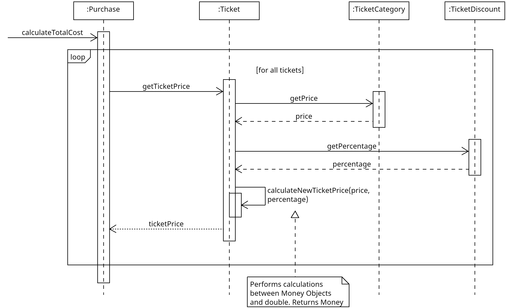
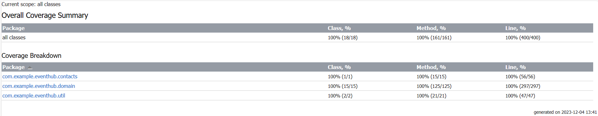

## 3.1 Διαγράμματα λογικής πεδίου

### Διάγραμμα κλάσης στατικης όψης

### Διαγράμματα ακολουθίας δυναμικής όψης
1. Μέθοδος calculateRating του Organizer

2. Μέθοδος canReview του Customer

3. Μέθοδος calculateTotalCost του Purchase

## 3.2 Υλοποίηση της λογικής του πεδίου
## [Link στο package main](../../../app/src/main/)

## 3.3 Αυτόματοι έλεγχοι σε JUnit
## [Link στο package test](../../../app/src/test/)

## 3.4 Αναφορές καλύψεων κώδικα

