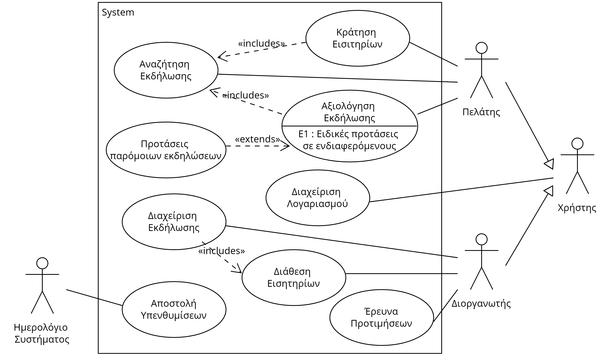
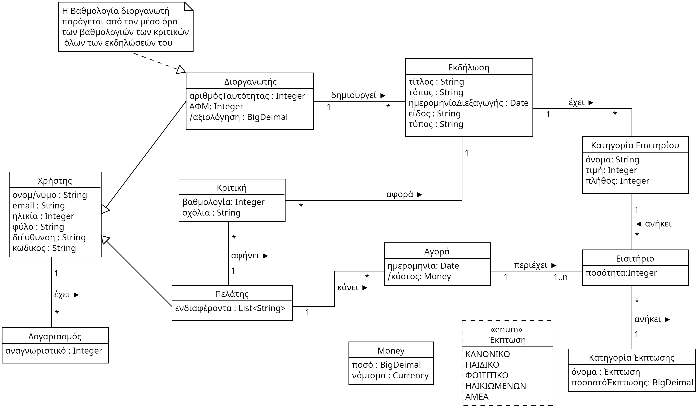

## 2.1.1 Διάγραμμα περιπτώσεων χρήσης

## 2.1.2 Περιπτώσεις χρήσης
### [ΠΧ1. Διαχείριση Λογαριασμού](1.account-management-greek.md)
### [ΠΧ2. Αναζήτηση Εκδήλωσης](2.event-search-greek.md)
### [ΠΧ3. Αξιολόγηση Εκδήλωσης](3.event-review-greek.md)
### [ΠΧ4. Κράτηση Εισιτηρίων](4.ticket-booking-greek.md)
### [ΠΧ5. Διαχείριση Εκδήλωσης](5.event-management-greek.md)
### [ΠΧ6. Διάθεση Εισιτηρίων](6.ticket-disposal-greek.md)

## 2.2 Ποιοτικά χαρακτηριστικά και μη λειτουργικές απαιτήσεις
1) Ευχρηστία: Η εφαρμογή θα είναι εύκολη στη χρήση για τους χρήστες, προσφέροντας φιλικό γραφικό περιβάλλον και ευανάγνωστο σχεδιασμό.Δεν απαιτείται από τον χρήστη καμία τεχνική γνώση.

2) Ασφάλεια: Η εφαρμογή θα εξασφαλίζει την ασφάλεια των προσωπικών δεδομένων των χρηστών και θα παρέχει μηχανισμούς αυθεντικοποίησης.Επιπλέον θα ενημερώνει τους χρήστες πως χρησιμοποιούνται τα δεδομένα τους και ποιος έχει πρόσβαση σε αυτά.

3) Απόδοση: Η εφαρμογή θα λειτουργεί αποτελεσματικά χωρίς καθυστερήσεις, προσφέροντας γρήγορη πρόσβαση σε πληροφορίες και λειτουργίες. Το σύστημα θα πρέπει να υποστηρίζει έως και 100 ταυτόχρονους χρήστες. Η απόκριση της βάσης δεδομένων σε κάθε αίτημα δεν θα πρέπει να ξεπερνά τα 3 δευτερόλεπτα.

4) Ακεραιότητα: Η εφαρμογή θα είναι σχεδιασμένη με τρόπο που να αντέχει σε απροσδόκητες συνθήκες, όπως είναι απότομες διακοπές τροφοδοσίας, διακοπές δικτύου, ή ανεπιθύμητες εισαγωγές δεδομένων από τους χρήστες. Κάθε ενέργεια διατηρεί το σύστημα σε συνεπή κατάσταση, καθώς είτε ολοκληρώνεται είτε δεν συμβαίνει καθόλου.

5) Ελεγξιμότητα: Η εφαρμογή θα περιέχει δοκιμαστικές διαδικασίες για να εξασφαλιστεί ότι η εφαρμογή λειτουργεί σωστά. Επιπλέον, θα γίνεται χρήση πολλαπλών JUnit tests για τον έλεγχο της σωστής λειτουργίας των κομματιών κώδικα.

6) Συντηρησιμότητα: Η εφαρμογή θα έχει καλά τεκμηριωμένο κώδικα, ώστε να είναι ευανάγνωστος και εύκολος στη συντήρηση. Επιπλέον, ο κώδικας θα είναι οργανωμένος και θα ακολουθεί βέλτιστες πρακτικές.

## 2.3.1 Μοντέλο Πεδίου

